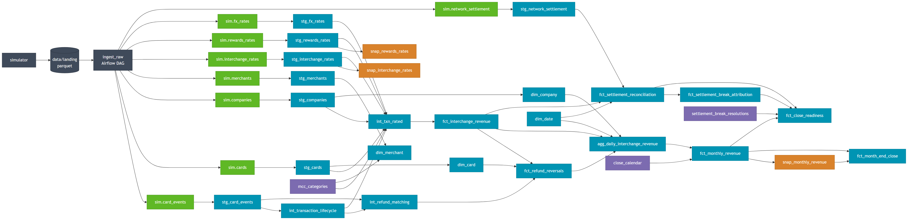

# Interchange revenue pipeline

Airflow + dbt + Snowflake pipeline that turns a raw card event stream into
recognised interchange revenue, reconciled against the card network's daily settlement
file.


## Architecture



**Grey** ingestion &nbsp;·&nbsp; **Green** raw sources &nbsp;·&nbsp; **Blue** dbt models &nbsp;·&nbsp; **Purple** seeds &nbsp;·&nbsp; **Orange** snapshots

## Tech stack

| Component | Used for |
|---|---|
| **Snowflake** | Warehouse. Raw, staging, intermediate, marts and snapshot schemas; key-pair auth with a service user |
| **dbt-core 1.12.3** / **dbt-snowflake 1.9.4** | Transformations, model contracts, data tests, unit tests, SCD2 snapshots, docs and lineage |
| **dbt packages** | `dbt_utils`, `dbt_expectations`, `dbt_date` |
| **Apache Airflow 3.3.1** (Astro Runtime, Docker) | Orchestrating ingestion; asset published when raw loads finish |
| **Python 3.12** | Source-data simulator and the ingestion loader (`PUT` + `COPY INTO`, idempotent, audited) |
| **pandas / pyarrow** | Generating and writing partitioned Parquet to the landing area |

## Deploying it

### Prerequisites

- Python 3.12
- Docker Desktop (for Airflow)
- Astro CLI
- A Snowflake account, and a key pair for the service user

### 1. Snowflake objects

Run `snowflake/bootstrap.sql` as `ACCOUNTADMIN`. It creates the warehouses
(`ingest_wh`, `transform_wh`, `ci_wh`), the `INTERCHANGE_RAW` and `INTERCHANGE_ANALYTICS`
databases, the `interchange_role` role, and the `svc_interchange` service user with
key-pair authentication.

### 2. Environment

Create `.env` in the repo root (gitignored):

```
SNOWFLAKE_ACCOUNT=<account identifier>
SNOWFLAKE_USER=svc_interchange
SNOWFLAKE_PRIVATE_KEY_PATH=.secrets/snowflake_key.p8
SNOWFLAKE_ROLE=interchange_role
SNOWFLAKE_WAREHOUSE=transform_wh
SNOWFLAKE_DATABASE=INTERCHANGE_ANALYTICS
SNOWFLAKE_INGEST_WAREHOUSE=ingest_wh
```

The first four are used by both the loader and dbt; `SNOWFLAKE_WAREHOUSE` and
`SNOWFLAKE_DATABASE` are read by `profiles.yml`, and `SNOWFLAKE_INGEST_WAREHOUSE` by the
loader.

Then set up the virtualenv:

```powershell
python -m venv .venv
.\.venv\Scripts\Activate.ps1
pip install dbt-core==1.12.3 dbt-snowflake==1.9.4 pandas pyarrow numpy faker snowflake-connector-python
. .\scripts\load-env.ps1
```

`requirements.txt` is separate: it holds only what the Airflow Docker image needs.

### 3. Generate source data

```powershell
python -m simulator --start 2024-01-01 --end 2024-03-31 --seed 42
```

Writes partitioned Parquet to `data/landing/` (gitignored). Deterministic, so the same
seed always produces the same data.

### 4. Load into Snowflake

```powershell
python -m include.ingestion load --start 2024-01-01 --end 2024-03-31
```

Idempotent: a file already recorded in `ingest_audit` is skipped, and a re-sent file with
changed content loads as a new batch.

### 5. Transform and test

```powershell
cd include\dbt\interchange
$env:DBT_PROFILES_DIR = (Get-Location).Path
dbt deps
dbt build
```

`dbt build` runs models, snapshots, seeds, data tests and unit tests in dependency order.
Source freshness is separate: `dbt source freshness`.

### 6. Documentation and lineage

```powershell
dbt docs generate
dbt docs serve --port 8081
```

Port 8081 avoids clashing with Airflow.

### 7. Airflow

```powershell
astro dev start
```

UI at http://localhost:8080. The `ingest_raw` DAG creates the raw objects, loads the eight
feeds, and publishes an asset when they finish. Stop it with `astro dev stop`.
